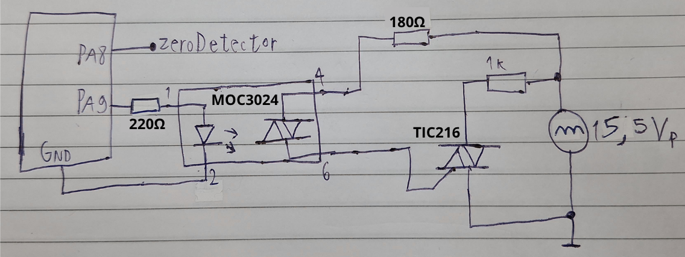
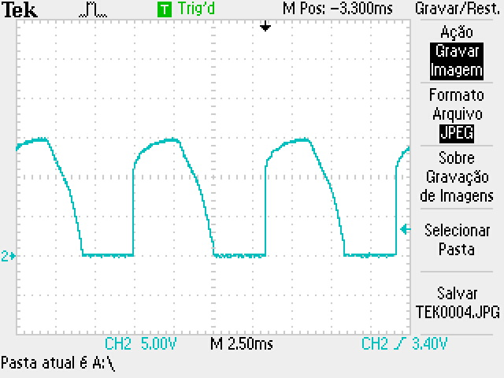
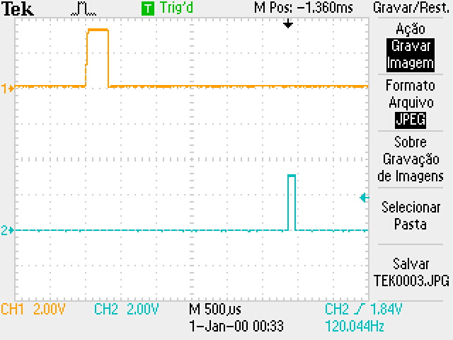
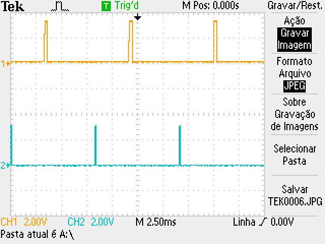
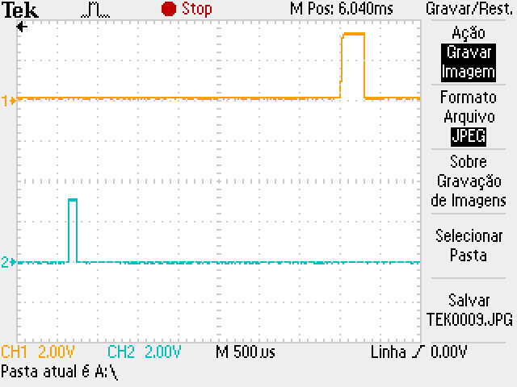

# triggerPulse & zeroDetector

This repeats the triggerPulse test, but with the real zeroDetector signal instead of a simulation (done with a TIM10 PWM channel in triggerPulse).

To protect the STM32, in addition to the optocoupler for the zeroDetector signal, there is a solid-state relay (SSR, aka opto-triac) to transmit the trigger pulse to the gate of the load triac. This way it is completely isolated from the AC power.

## The trigger

### Code

The zeroDetector enables TIM1, which counts at 7MHz. When the couting reaches CCR2, it generates a pulse of width $100us$ (700 ticks according to the OC interruption function) in channel 2.

### Circuit

This is NOT the final version of it, but rather a test one. Our only goal was to verify that the wave would be croped the way that the triggering system wants to. The real circuit has an AC 220V power supply instead of a rectified 12V, for example.

### SSR resistor
According to TIC216's datasheet (our triac; availiable in "Datasheets" directory), the $I_{GT}$ (Peak Gate Trigger Current) is $5mA$. Thus, for guaranteed triggering when the source is 1V (defined as the lowest triggerable voltage), a 180Ω resistor is in series with the SSR ($\frac{1V}{180Ω}\approx5.5mA$). This raises the problem of power dissipation. This is an aweful way to trigger because the resistor dissipates $1.6W$ when $V = V_{p} \approx 16V$.

### Results

#### CCR = 20000 (2.86ms of phase between zeroDetector and trigger)

Waveform:

zeroDetector pulse (yellow) and trigger pulse (blue):

#### CCR = 35000 (5ms of phase between zeroDetector and trigger)

Waveform:

zeroDetector pulse (yellow) and trigger pulse (blue):

