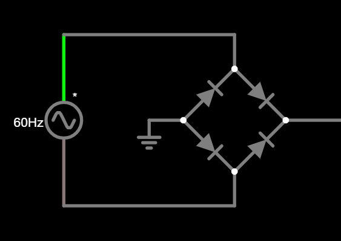
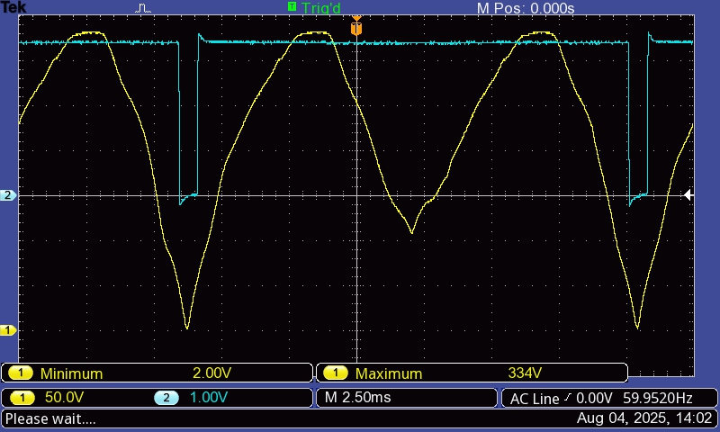

# zeroDetector problem

For some unknown reason, the voltage after rectification isn't behaving as expected. Instead of a completely rectified sine wave from 0V to 310V, the voltage after rectification is:

At one semicycle the voltage drops to 2V and not 0V (expected because of circuit capacitance), but at another it drops to only 108V.

As an experiment we're going to transform the 220Vrms to 12Vrms before rectifying (changing the comparator's resistors values accordingly).