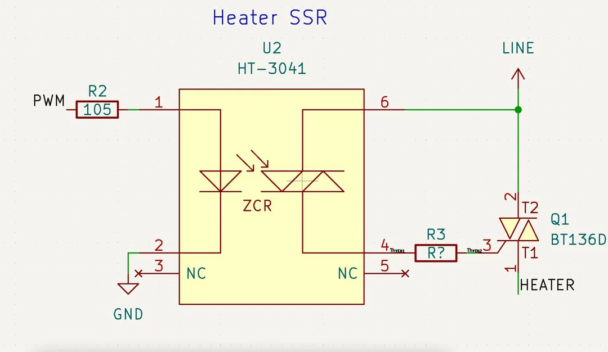
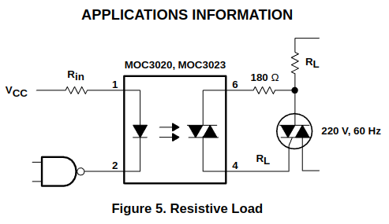
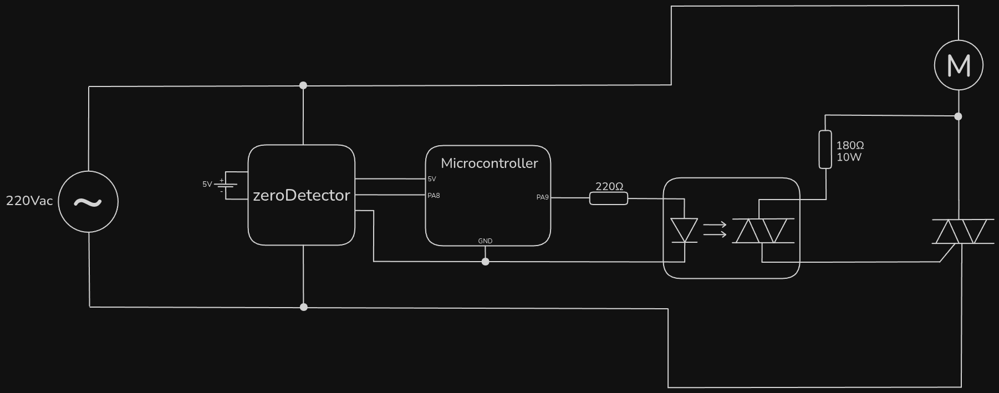
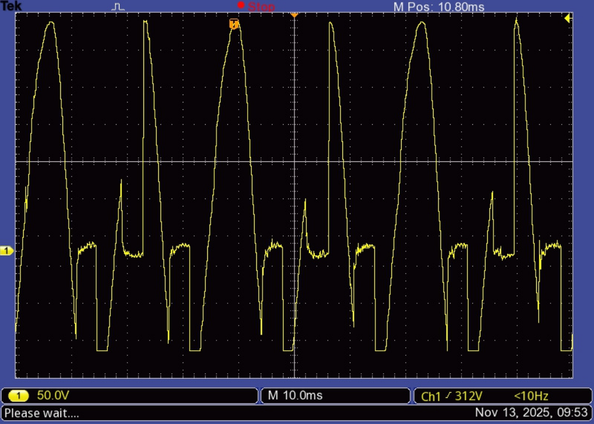

# standardControl

The "standard control" refers to the following way to control the TRIAC using a SSR (Solid State Relay):

This way the AC source itself is applied to the gate whenever the SSR's output is closed. The upside is that no additional source is needed. On the other hand, the trigger pulse cannot happen at an instant during which the AC source's voltage is too small. This might be a problem at very high power ratios, with which the trigger happens right after (or even in sync with) the zero detection pulse.

A possible solution is to set the trigger as "always up" when the desired power ratio is higher than a threshold, which must be close to 100%. If this prove itself as a problem, other solutions must be considered.

## Resistor values

According to MOC3021's datasheet:

This made me wonder if wouldn't the resistor suffer an overload and burn. After talking to the professor, I made a mistake considering that the voltage between the gate an the upper terminal (above in the diagram) whould be 1.4V (it's actually between the gate and the lower terminal), and the professor told me to test it out.

No surprises, it was burned. The voltage at it was almost 16Vrms, which exceeds five times the maximum power dissipation at the resistor.

## Results

After replacing it for a 180Ω 10W resistor, the final circuit was:

The voltage measured between the terminals of the electric motor follows:

## Discussion

At a glance, we see some desired behaviors, and others that aren't. The positive part of the wave is correct 3 times in the screenshot, when it jumps from 0V to wave voltage. This happens with the trigger pulse.

After crossing the zero-voltage region, it dives a bit to the negative region. This is because the motor's inductance, which ranges arround 440mH. The current is inducted by the motor to the TRIAC, so the current that flows through stays greater than its holding current for an amount of time. The symmetric (from negative to positive) is also noticeble.

What was not expected here is that at some cycles (3 visible in the picture above), the wave simply isn't cut after crossing zero. This doesn't happen at the negative part of the wave, but there it is always cut horizontally - the wave doesn't go all the way to its peak, but saturates at a seamingly random voltage.

The inductance problem will be addressed first.