# inductiveLayout

MOC3021's datasheet suggests the following control circuit to inductive loads:

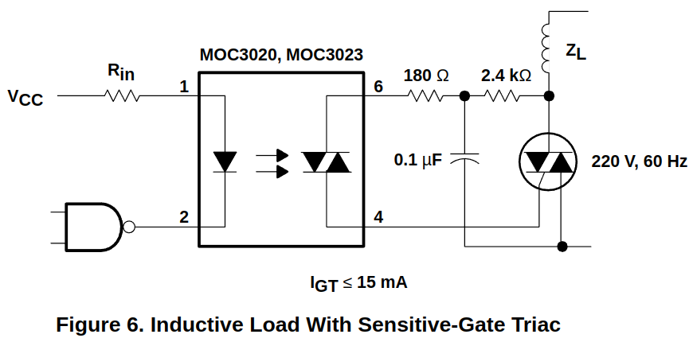

After researching about this layout, the previous circuit was replaced by the following [(source)](https://www.newtoncbraga.com.br/como-funciona/677-reles-de-estado-solido.html):

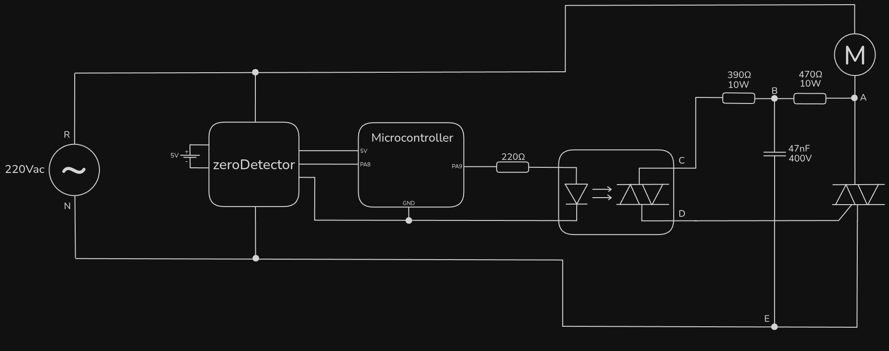

## Results

The measurements, made out from this circuit, according to the named knots, follow:

### $V_{AB}$

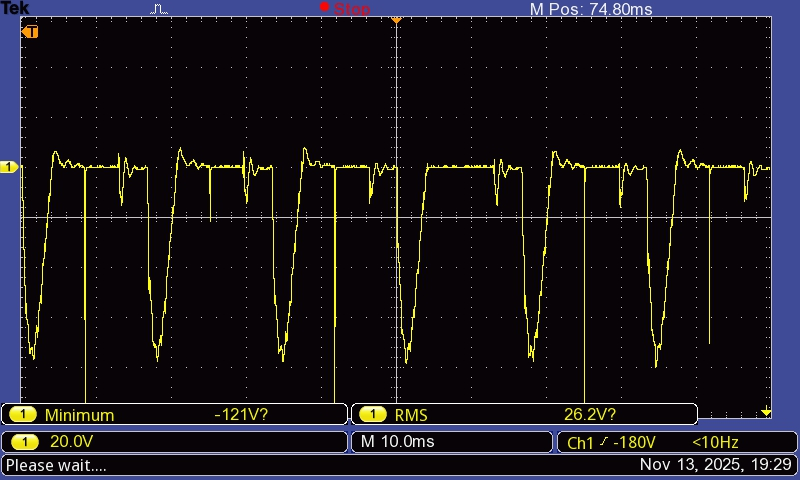

### $V_{BE}$

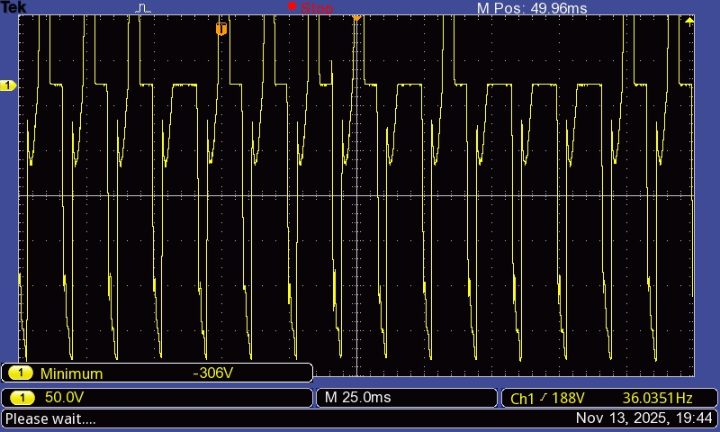

### $V_{BC}$

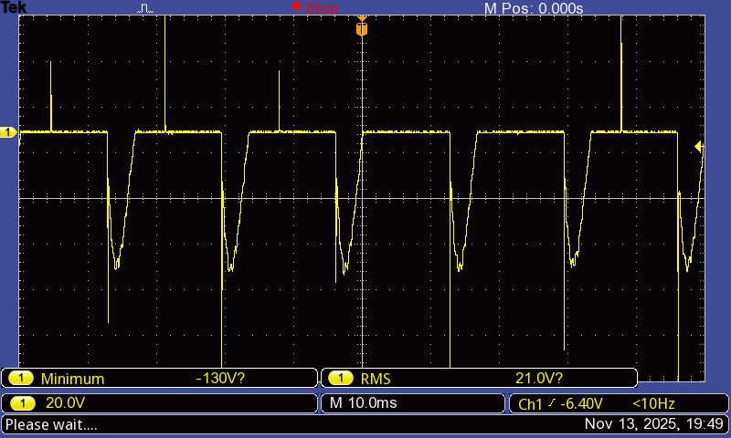

### $V_{DE}$

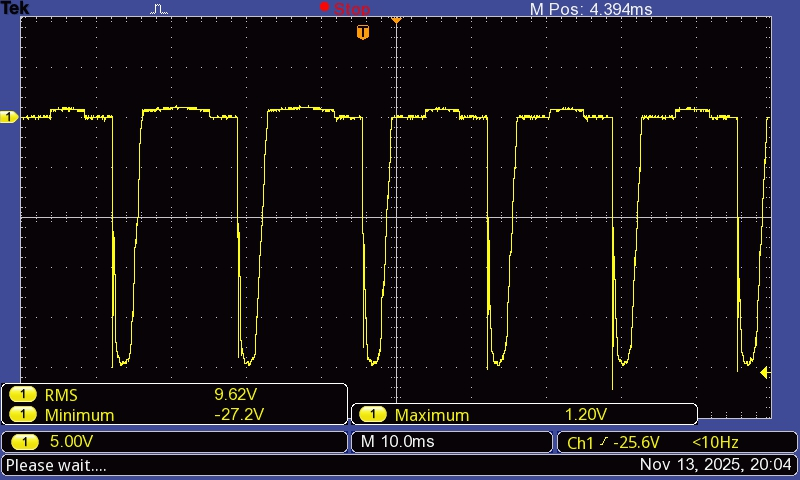

### $V_{CD}$

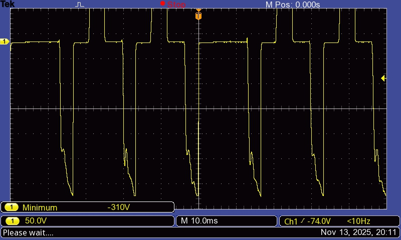
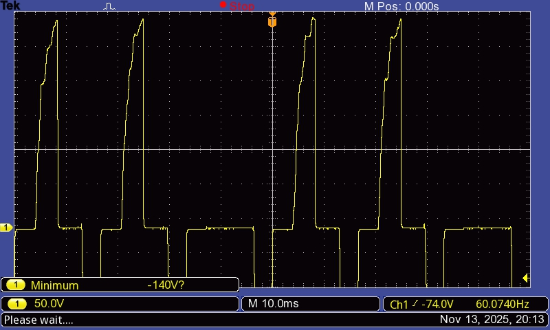

### $V_{AE}$

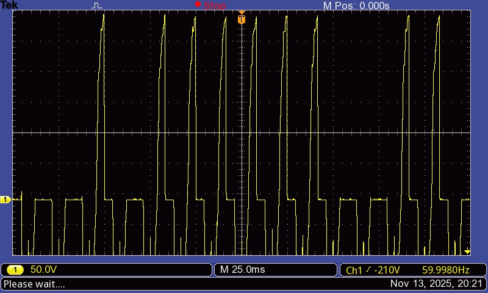
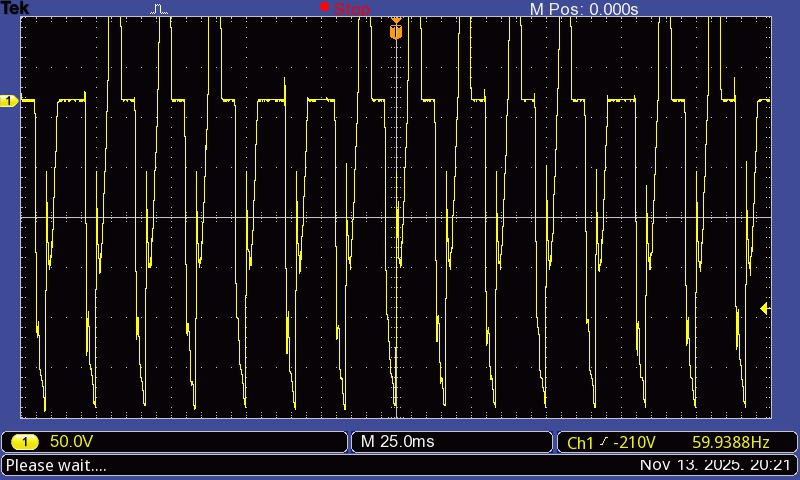

### $V_{AE}$ (yellow) & $V_{DE}$ (blue)

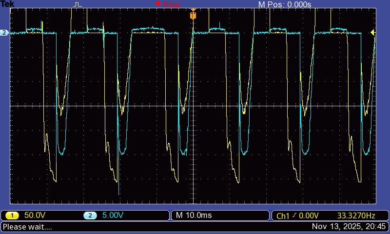
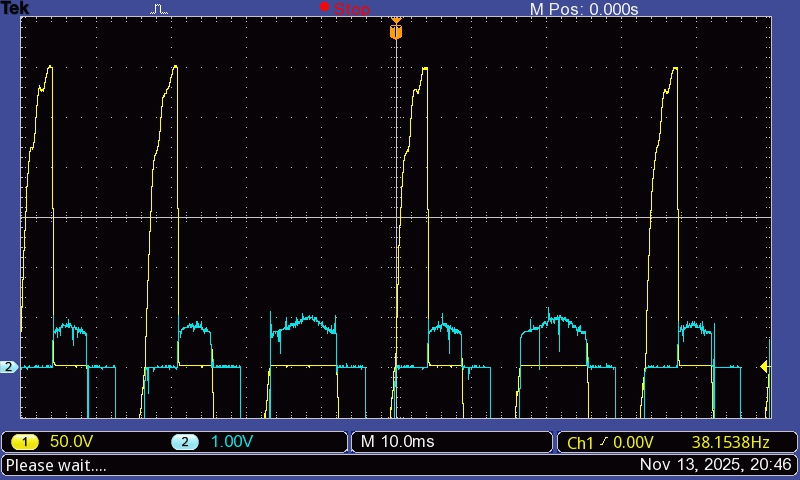

### $V_{AE}$ (yellow) & $V_{BE}$ (blue) & $V_{AB}$ (red)

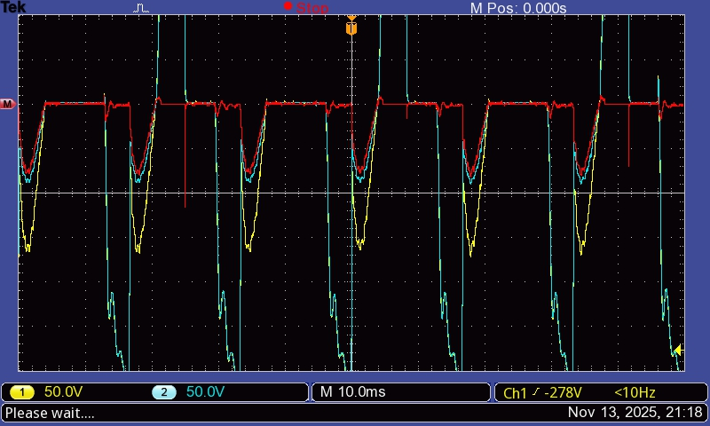

## Discussion

Two undesired behaviors are observed.

### No Stop

In $V_{AE}$, the sections with normal wave shape are the ones in which the TRIAC is open, whereas it's closed at the flat 0V sections.

As seen in $V_{AE}$'s chart, at some cycles the TRIAC simply doesn't open at the zero crossing. This always happens at the positive semicycle. The occurrences coincide with the motor wave not being cut.

### Bounce

Also in $V_{AE}$, at the negative semicycle, we see that every single time, right after the trigger, instead of becoming 0V and staying there until the next zero crossing, the wave bounces back down, eventually becoming a sine-shaped again.

There's a delay until the capacitor in paralel catches up to the new voltage. This causes a temporary difference of potential between the $V_{AB}$ resistor. That's the reason why the negative 5ms-large negative peak of its voltage exists. That means it shouldn't.

### Conlcusion

A good hint of the solution might lie in the $V_{DE}$ chart, which is the Gate-MT1 voltage. In the normal iterations, it is zero from the zero crossing up to the trigger, when it becomes arround 1V up to the next zero crossing. This is expected.

However, when the noStop happens, $V_{DE}$ is 1V from the zero crossing itself. Probably because right before the zero crossing, the bounce happens. Note that there is current flowing through the gate right before the zero crossing. This current might be keeping the TRIAC closed through the zero crossing, cousing the noStopping.

This suggests the noStopping is caused by the bouncing. Fixing it should fix both problems.