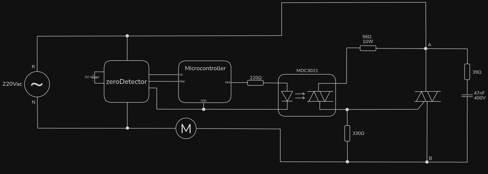
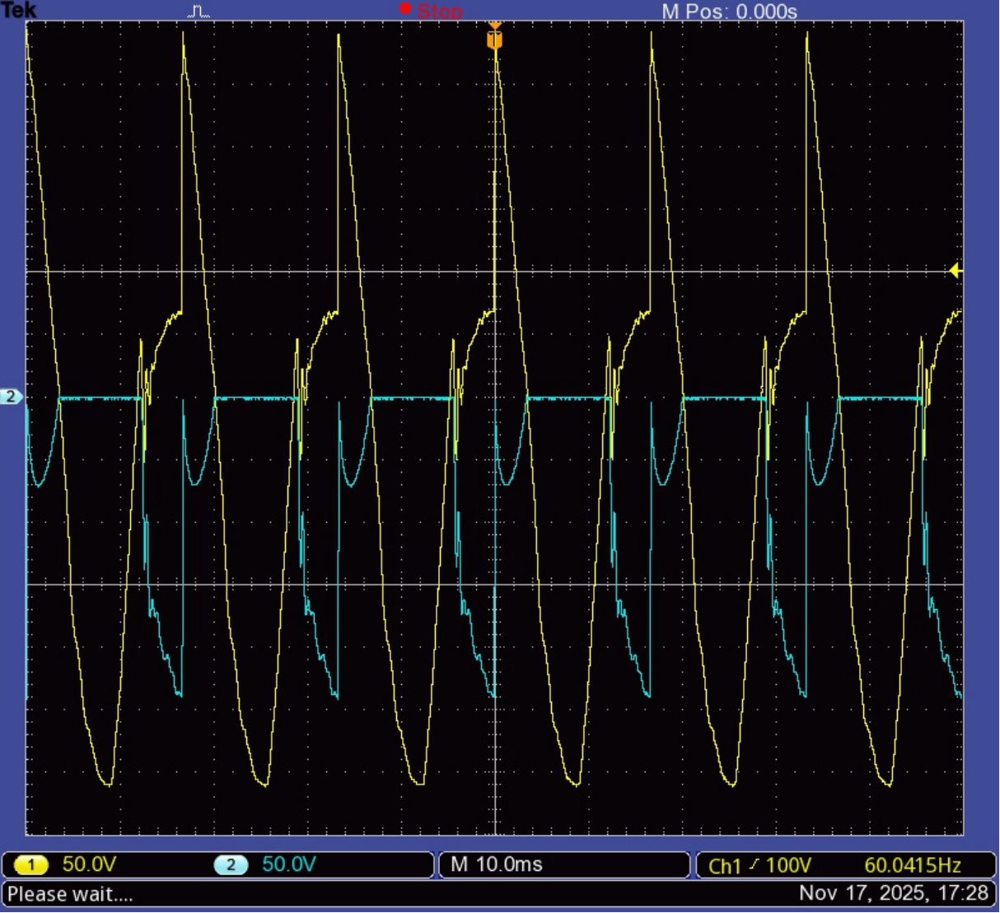

# motorAtNeutral

As replacing the TRIAC and changing the pulse width didn't solve any of the problems of 0.1.1, I reached out the professor and showed what was going on. He said everything is right and it should be working correctly.

He suggested us to replace the universal motor, that we were using, by an induction, brushless motor, that produces way less noise.

As we knew that at least the bouncing problem was not because of the noise (because it was consistent and recurrent), along with replacing the motor, another layout was tested. Its schematic follows [(source)](https://www.axtudo.com/circuito-de-rele-de-estado-solido-com-triacs-e-comutacao-de-cruzamento-zero/?srsltid=AfmBOooE2en9hLTdUg__lGTFmMbwJuh5DDCAdz1uwc9GNFzgonOQyEez):

## Results

### $V_{NB}$ (yellow) & $V_{AB}$ (blue)

The yellow line is the negative of the motor voltage ($B$ as reference and $N$ as measurement knot), while the blue line measures the TRIAC voltage.

## Discussion

First of all, a huge reduction of noise is noticeble because of the brushless motor.

Second, the bouncing not only is still present, but if the conclusion of the last version was correct, is keeping the TRIAC closed in every half-cycle, as seen.

After speaking with the professor again, none of us could understand the reason for the bouncing, since tests show that the pulses appear to be correct and the layout is widely recognized as functional.