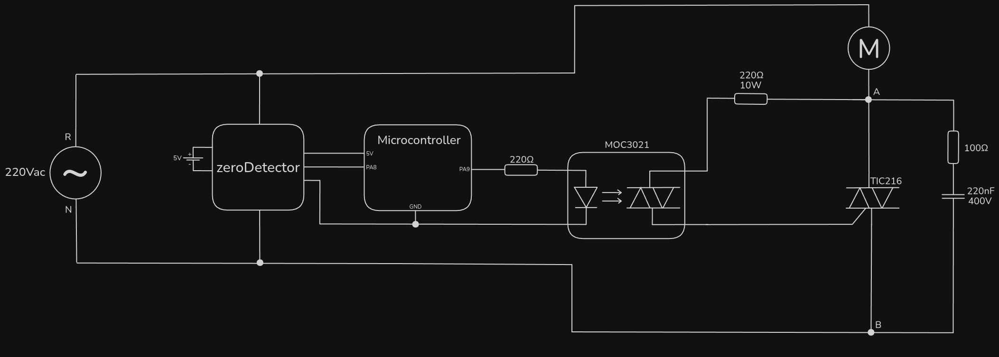
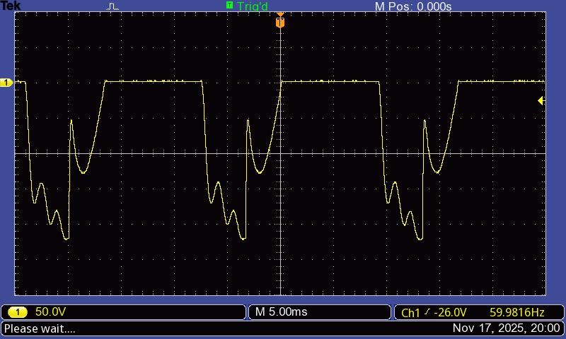

# minecraftsLayout

After reading a few more softstarter papers from previous years' students, I found that the one that used Minecraft as a controlling interface also did with the MOC3021 SSR. Their layout was:

PS: the TRIAC they used was not TIC216, but rather the BT137.

If it worked for them, it should fix the problems related in the older versions, whatever they are, if the components are working correctly (tests indicate they are).

## Results

### $V_{AB}$

## Discussion

The same old bouncing problem is still there. As I tested different SSRs and TRIACs (of the same model), the problem must be the model of the components itself.