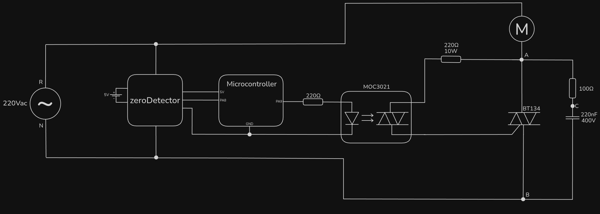
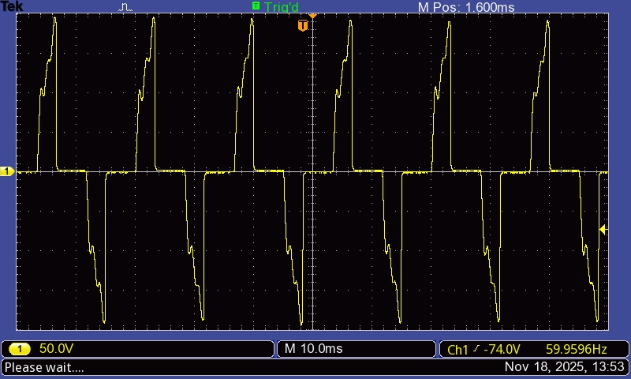
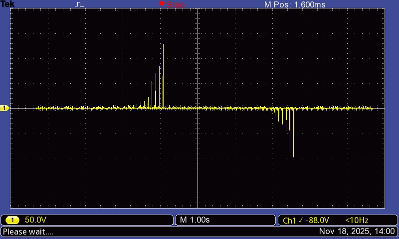

# newTriac

According to the conclusion from the discussions of the 0.1.x versions, the TIC216 was replaced by a BT134, another TRIAC. Its max RMS current is 4A, which should be enough. Typical gate trigger current starts from 5mA.

## Results

### $V_{AB}$

### $V_{AC}$

## Discussion

As seen in $V_{AB}$, the wave is being correctly cut and its shape is the expected. A few different trigger angles were tested, and all seemed correct.

The only problem was that the 100Ω resistor smelled bad and turned dark. When measuring the voltage between it, some peaks of over 100V were detected.

Instead of replacing it for another value or a power resistor, a better approach would be to bring the inductive layout back, as the motor voltage's shape is heavily influenced by its inductance.