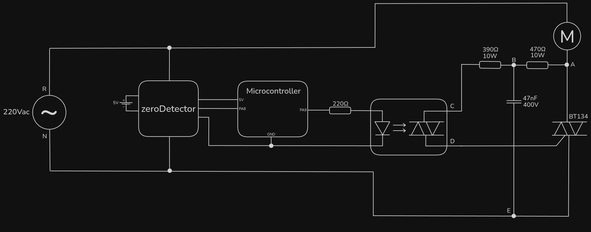
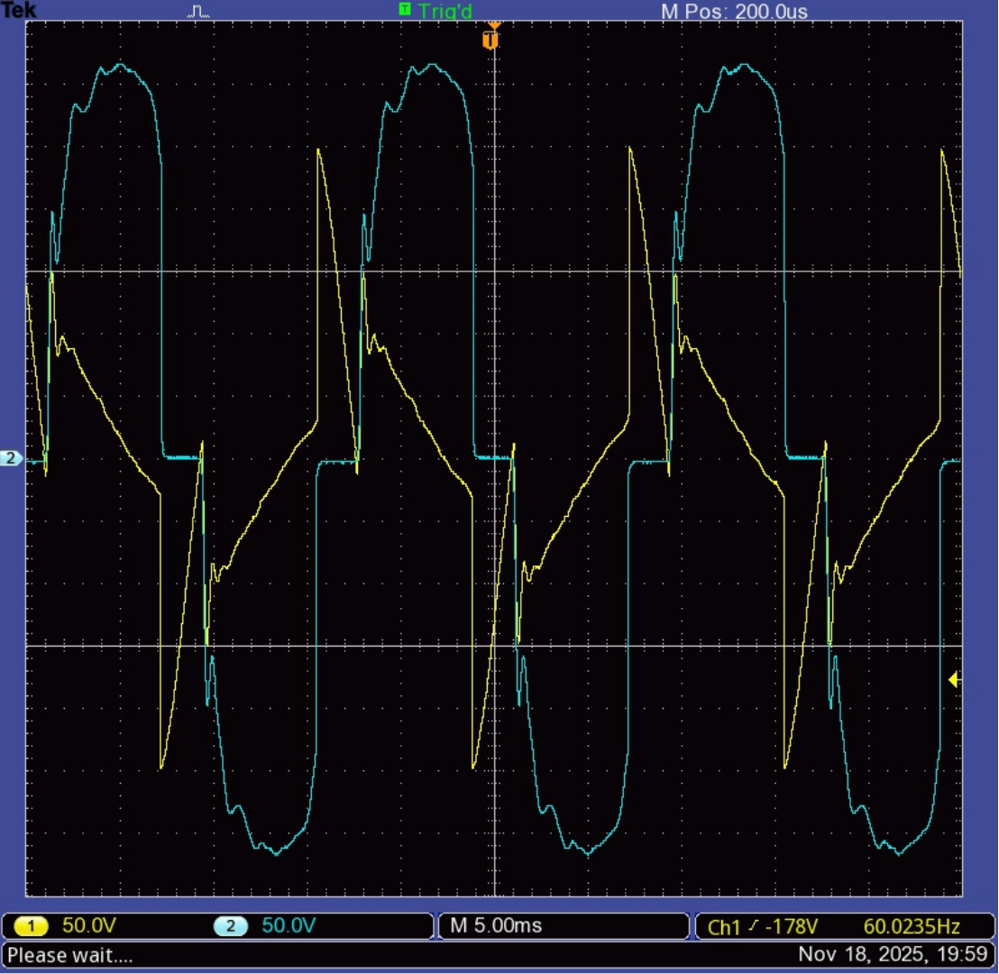
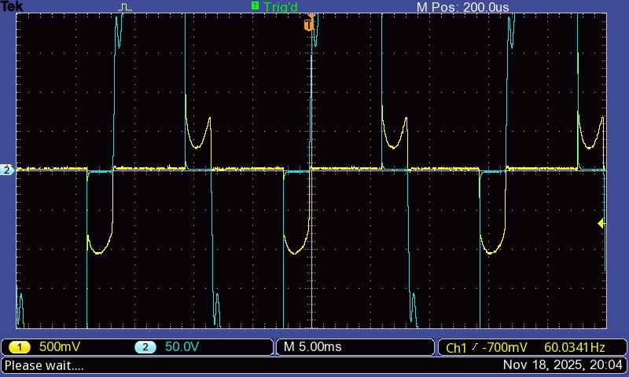
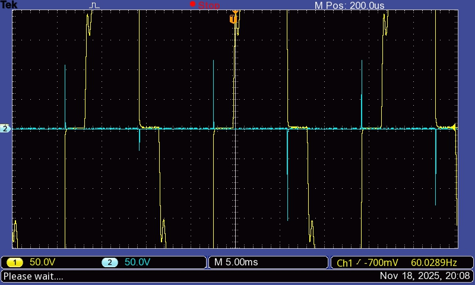

# inductiveAgain

With the bouncing solved, it's clever to return to a more complete layout. The one used in 0.1.1, suggested by Texas Instruments (MOC3021's manufacturer), seemed like a good one, as it considers an inductive load.

## Results

### $V_{RA}$ (yellow) & $V_{EA}$ (blue)

### $V_{DE}$ (yellow) & $V_{AE}$ (blue)

### $V_{DC}$ (yellow) & $V_{BC}$ (blue)

## Discussion

The TRIAC voltage looks very nice, but the motor voltage doesn't. The trigger is working correctly, and the voltage dives shortly below 0V (or above, in the opposite semi-cycle), which's expected because of the motor's inductance.

The problem is that right after that, instead of stabilizing at zero until the next trigger, it suddently returns to the positive region, oscilates a bit, just to slowly return to 0V. When this moment arrives, the next trigger is already happening, and the loop repeats.

At least the errors are symetrical. Looks like it's an actual designing mistake instead of any component that's not working as expecting.