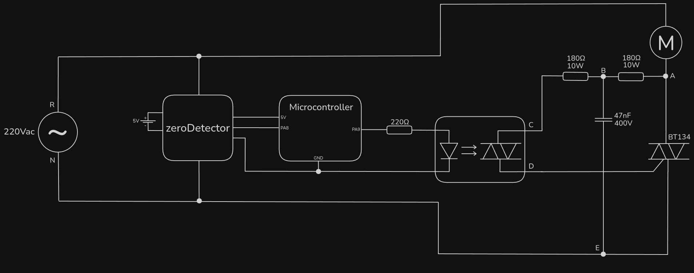
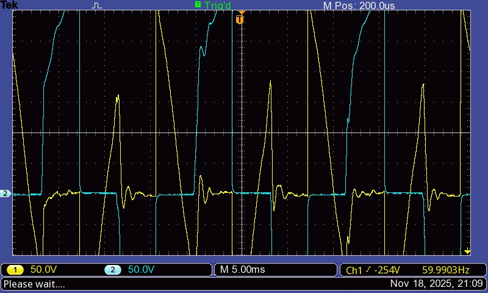
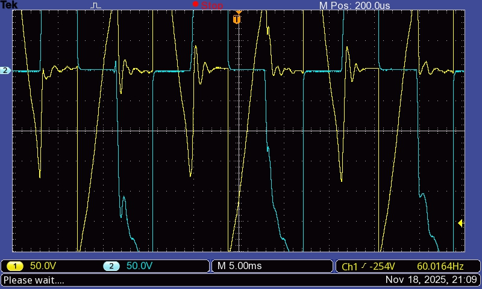
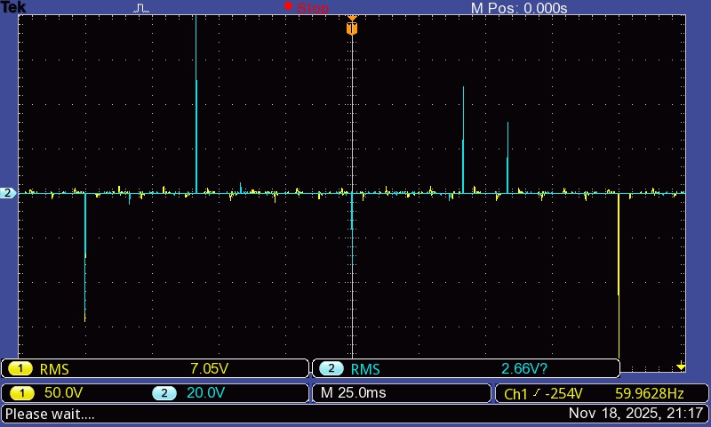
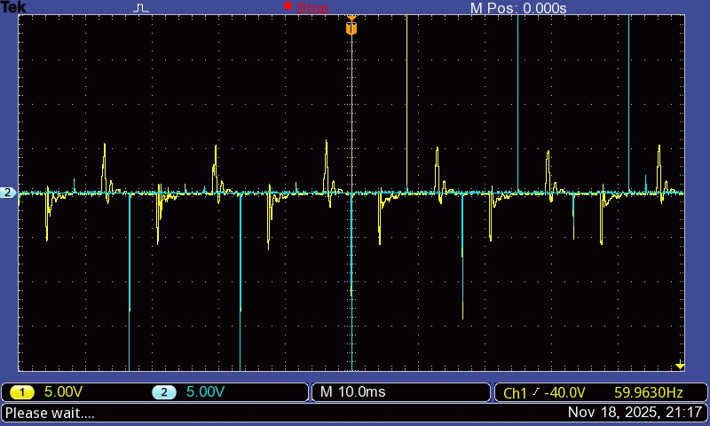
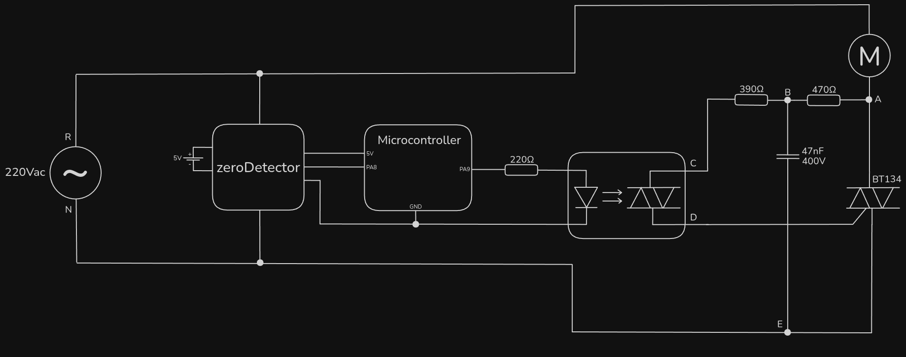

# universalBack

We supposed that the long time it was taking for the motor voltage to become zero could be due to high resistor values. Changing that made no difference.

The inference of that was that the induction motor was the reason for the misbehavior, maybe because of its momentum and architecture.

Replacing the induction motor by the universal motor resulted in:

## Results

### $V_{RA}$ (yellow) & $V_{EA}$ (blue)

### $V_{AB}$ (yellow) & $V_{CB}$ (blue)

## Discussion

The problem related in 0.2.1 isn't present anymore, and the wave looks more like it should.

But this created another problem. After crossing 0V, it's bearable that the motor voltage dives a bit before actually stabilizing at zero. However, this is too much. This "extension" lasts for almost 45°, what would distort the power ratio too much from the calculated, as $P_R$ calculation considers no extension.

Furthermore, the measured RMS voltage in both 180Ω doesn't surpass 8V. Between a 390Ω, this would mean no more than 170mW of power dissipation. Therefore, the 10W resistor are not necessary, leaving the final result of this version as:

