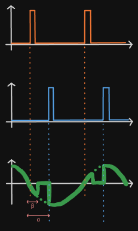
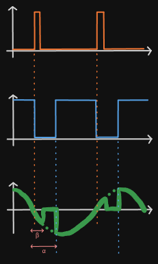
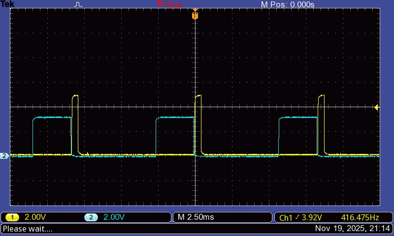
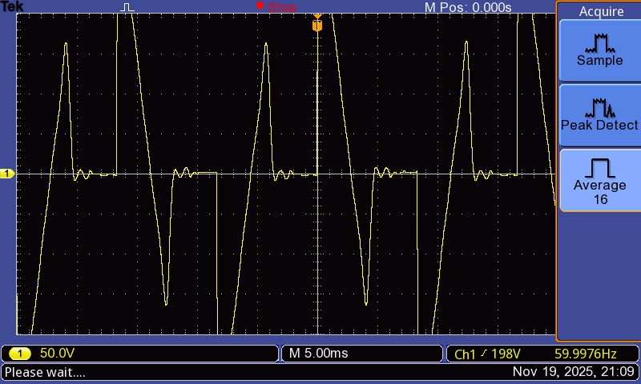
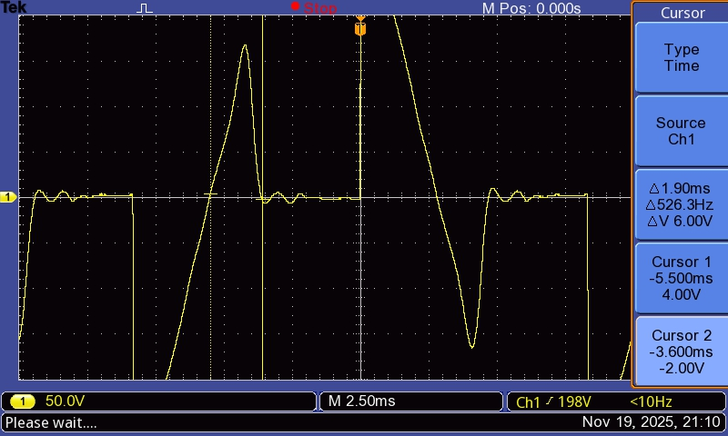

# pwm

As the attempt to fix the extension failed, we're going to have to deal with it. The first problem that had to be addressed was that if the trigger pulse was done during the extension (trigger angle < extension size angle), there would be no effect at all in the TRIAC. When the extension ends, it'd go off (open circuit) and the wave would be just zero up to the next semi-cycle.

When setting the trigger angle to ~10°, the resulting motor voltage measured was:

Notice that, in fact, in most of the cycles, the wave appears only in one side of the x-axis. The extension is still present. Also, the voltage doesn't stabilize well on 0V.

## Why PWM instead of PPM

The PPM being used now looks like this:

It works just fine when α>β. However, if this condition is not true, the problem described in the first paragraph takes place. Intuitively, if the trigger were to happen inside the extension (α<β), it could be enlarged up to when it effectively triggered the TRIAC.

Instead of calculating or measuring the necessary lenght of the trigger pulse for that, why not just make it last up to the next cycle? We initially thought that'd make the gate resistor dissipate too much power, but then realized that while the TRIAC if on, the voltage between MT1 and MT2 is roughly zero, and so is the voltage between Gate-MT1.

Therefore, the following can be done:

As explained, in this layout, the gate-resistor voltage is just a spike at the rising edges of the trigger signal (blue). When α>β, the TRIAC activation will work just fine. When α<β, the spike only happens after the extension is over, and the voltage would be about to drop to zero again. This triggers the TRIAC right on time in a way that the whole sine wave in transferred to the motor.

## Results

### zeroDetector (yellow) & trigger (blue)

_PS: trigger ≃ 124°_

### Motor voltage

## Discussion

The usage of PWM trigger instead of PPM did not cause any misbehavior. With ~124° trigger, the β angle was ~41°. Measurement below:

Keeping in mind that the extension happens due to the motor's inductance, it is presumable that the greater the current flowing through it, the longer it'll take for it to vanish, increasing β. As the current depends of the average voltage, which is a function of α, we know that β is not constant, but a function of α.