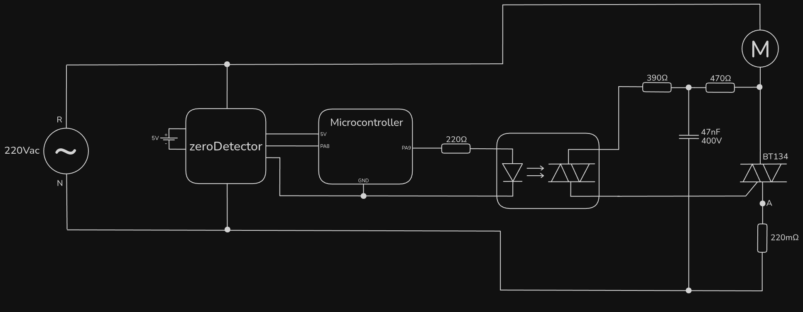
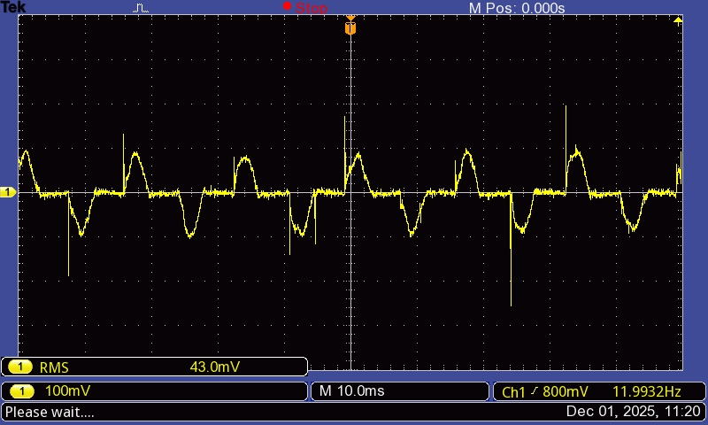
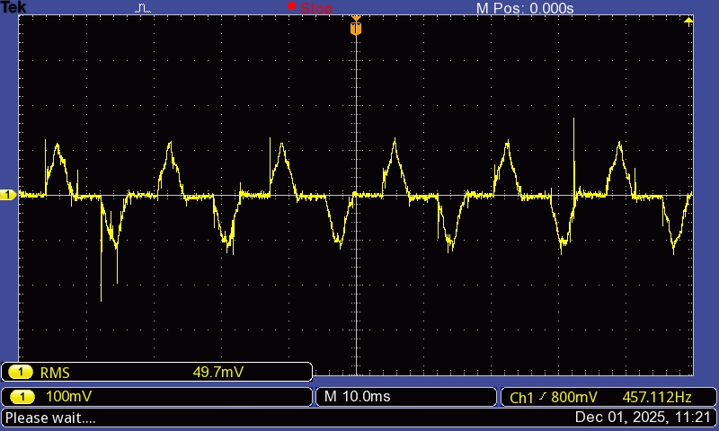
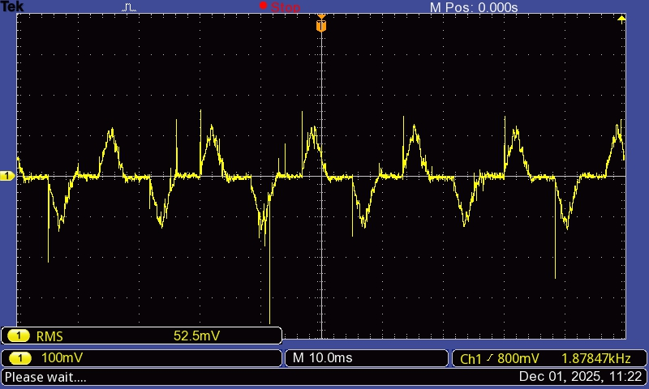
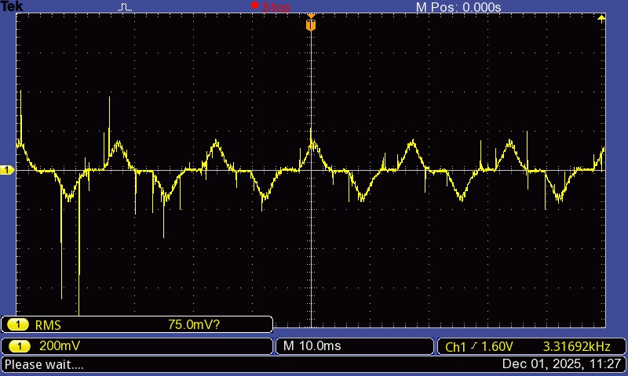
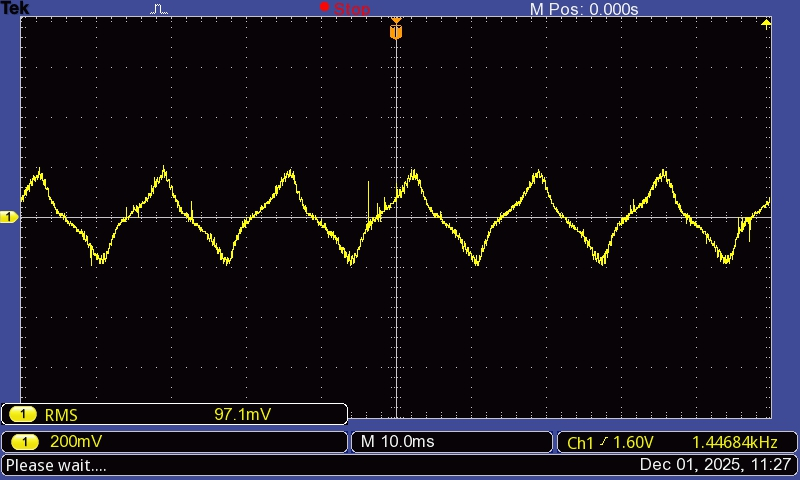

# currentMeasurement

In order to build the overcurrent protection circuit, the first step was to measure the current through the motor. The method used was with a shunt resistor:

The $V_{AN}$ was measured for different $S_r$ values:

### $S_r=10\%$

### $S_r=20\%$

### $S_r=30\%$

### $S_r=50\%$

### $S_r=70\%$

### $S_r=100\%$

