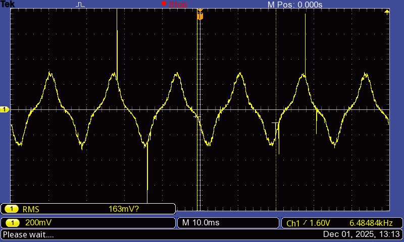
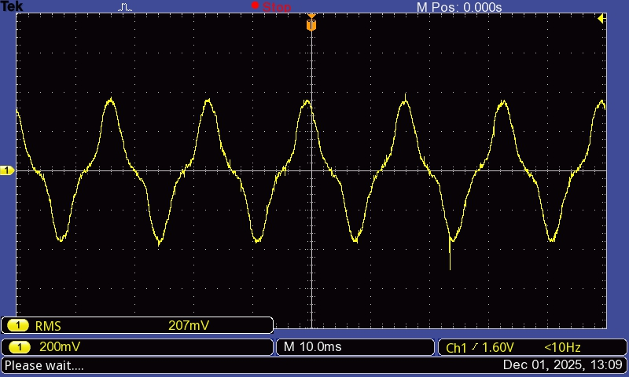

# currentMeasurement

In order to build the overcurrent protection circuit, the first step was to measure the current through the motor. The method used was with a shunt resistor:

## Results

The $V_{AN}$ was measured for different $S_r$ values:

### $S_r=10\%$

### $S_r=20\%$

### $S_r=30\%$

### $S_r=50\%$

### $S_r=70\%$

### $S_r=100\%$

### $S_r=100\%; I=1.5I_{typ}$

$V_{shunt_{peak}}=360mV$

### $S_r=100\%; I=2I_{typ}$

$V_{shunt_{peak}}=280mV$

## Discussion

If we can measure the current discretely frequently enough, we can just check if it's greater than a desired threshold to take action.

The typical motor current is $500mA$. The system has to shut down if it's more than $1A$, or pull the trigger back if more than $750mA$ ($2\cdot I_{typ}$ ; $1.5\cdot I_{typ}$ - project criteria).