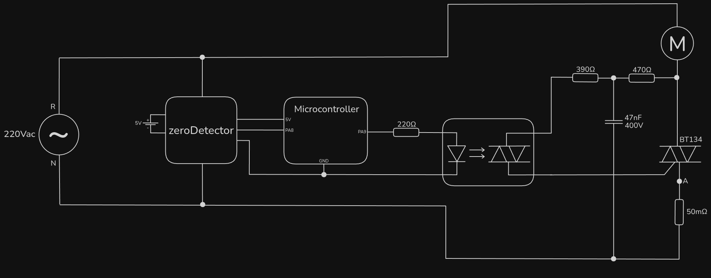
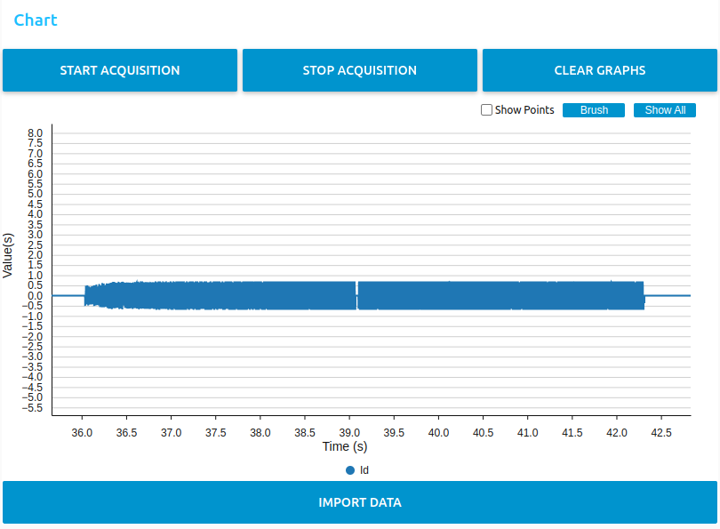
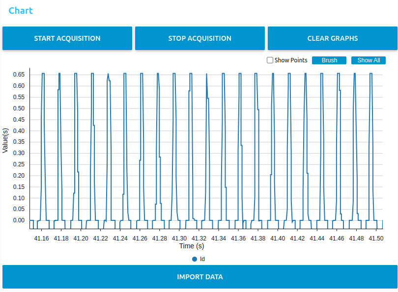
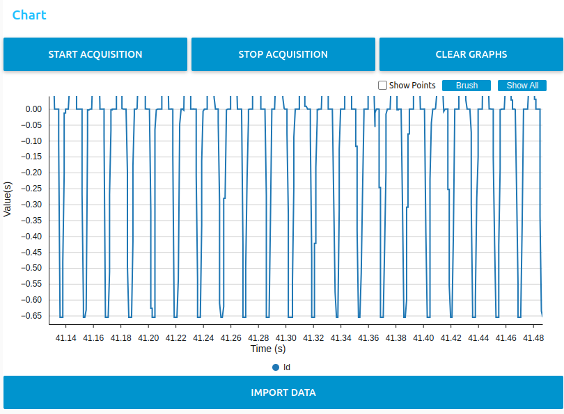

# ina226

This version uses an INA226 module to measure and store the current in the STM32.

However, it is not working correctly.

As an example, the rising ramp was set to 15s. The motor current was measured using a scope, and the $I_D$ measurement (from INA226), tracked using CubeMonitor. Meanwhile, the variables were being tracked using the debugger.

It has been observed that _time_ms_ behaves as expected, just as the motor voltage. In the other hand, $I_D$ suddently stopped being updated:

It was normal from the start of the rising ramp (~36s) up to ~42s.

_PS: the shunt resistor was congigured as $50mΩ$ in INA226, but was a $100mΩ$ in the circuit during these measurements. So, the values themselves aren't relevant, but the chart's shape.
This mistake has been solved, but the issue continued - that was not the problem._

Notice that the values seem correct while the measurements are being done, as they look like the scope-measured current (avaliable in 0.5.0). But without the reliability that $I_D$ will stay up to date, they are useless.

A lot of tests have been carried out about that. Different shunt conversion times, different I²C clock frequencies, and more. The only adjustment that solved the issue was to increase the current register's reading (function _INA226_GetCurrent()_ call) gap to 60ms. Then, $I_D$ was always up to date, but with a time resolution unfeasibly low.

When calling _INA226_GetCurrent()_ each $1ms$, which would already be a too low resolution, the issue persisted.