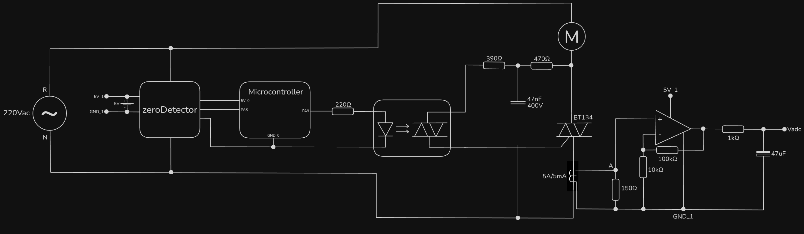
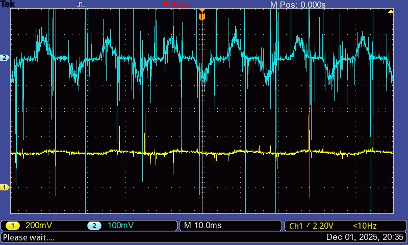
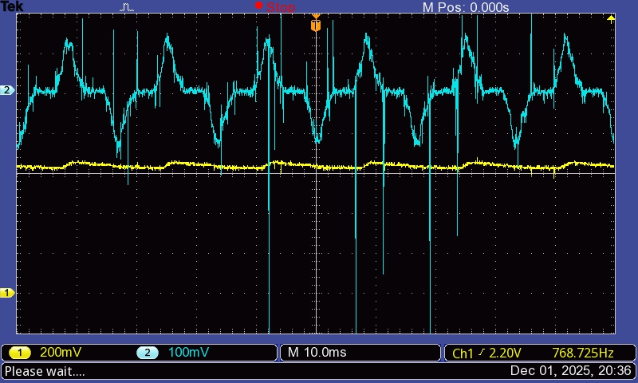
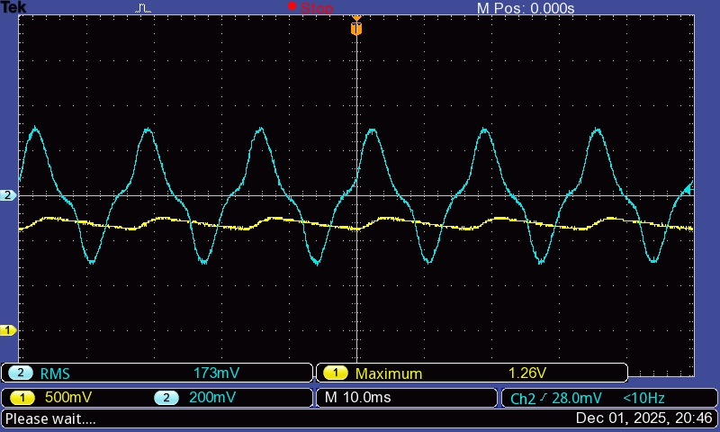
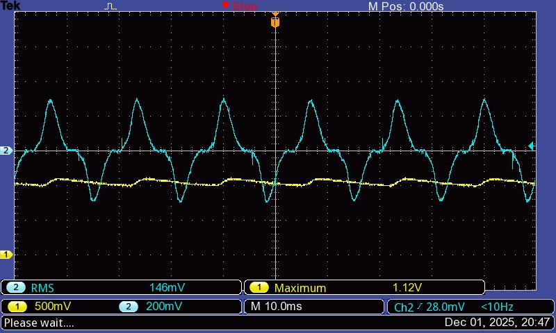
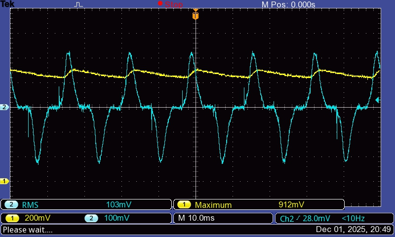
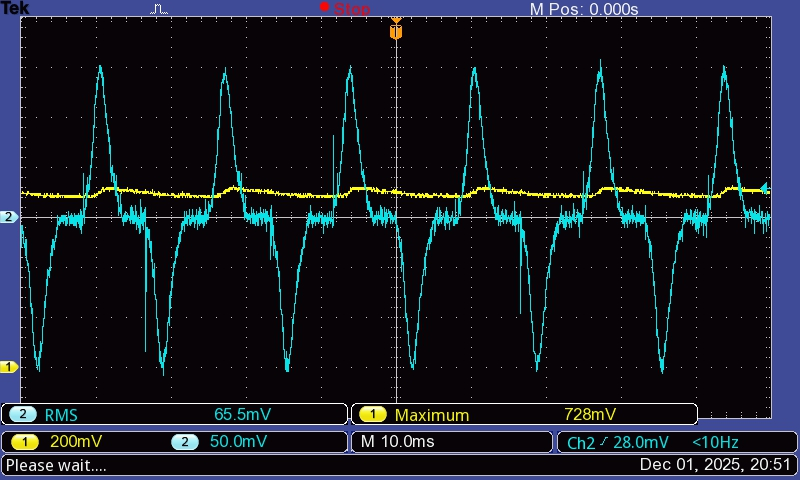

# currentTransformer

It was found out that the last version's problem was that the motor noise was corrupting the data being transmitted through SDA. A few noise reduction techniques were applied, but none could prevent the I²C communication from failing. Therefore, it is not viable (if not possible) to use INA226 to measure the current. In this version, it has been replaced by a current transformer.

A current transformer has a hole through which a wire goes. In this application, the motor current flows through this wire. It has two terminals. Once connected by a resistor, a current (proportional to the one through the hole) flows between these terminals. The transformer used has a relation 1000:1 (each Ampere through the hole causes a 1mA current between the terminals).

The signal processing follows:

A motor current of $1A$ causes a voltage of $150mV$ between the $150Ω$ resistor. The Op. Amp. multiplies the input voltage by $11$. This output is then applied to a filter, which'll take its average elapsed in time.

Recalling from 0.5.0, we know that the current is not constant and has a not very smooth shape. A few measurements were made in order to determine how $V_{ADC}$ relates to the motor current.

## Results

In all measurements, $CH1 (yellow)$ is $V_{ADC}$ and $CH2 (blue)$ is $V_{A-GND_1}$

### $S_r=40\%$ ; no break

### $S_r=40\%$ ; with break

### $S_r=100\%$ ; full break (motor stopped)

### $S_r=75\%$ ; full break (motor stopped)

### $S_r=50\%$ ; full break (motor stopped)

### $S_r=30\%$ ; full break (motor stopped)

