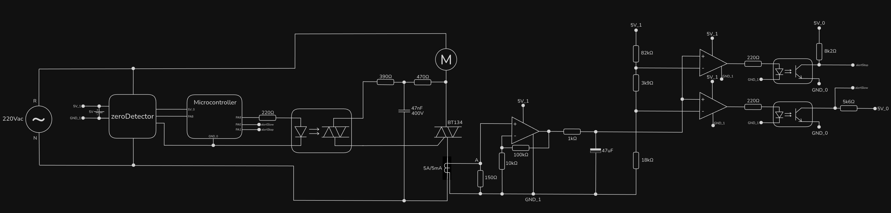

# alerts

As the analog signal that represents the motor current doesn't have the same reference (GND) as the STM32, an alert system has been implemented.

## Explanation

### Current calculation

According to the data from 0.5.2, it was seen that:

#### $I_{motor}=1.347\cdot V_{ADC_{max}} - 0.5441$

So $V_{ADC}=960.6mV$ when $I_{motor}=750mA$, and $V_{ADC}=1.146V$ when $I_{motor}=1A$.

### Circuit

The circuit developed has to digital outputs, which are input to the microcontroller: $alertStop$ and $alertSlow$ ($I_{motor}>1A$ and $I_{motor}>750mA$, respectively).

Each falling edge of the alerts generate an interruption. Yet, they only print a notificaiton in the console.

## Issue

The alerts and interrupts work fine, but the heavy noise generates spikes that trigger the alerts many times during normal operaiton.