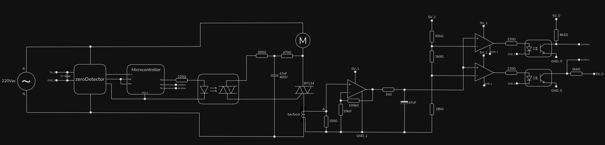

# phaseDetection

Among the project criteria was one that stated that the system had to be shut if there was a phase loss (energy down).

The zeroDetector was used as a phaseDetector, as it is a 120Hz PWM signal when the phase is up, and always low when there is no phase.

The zeroDetector signal pin, already connected to PA8 (TIM1's CH1 - trigger source), was connected to PA4 as well. At each zeroDetector's rising edge, an interruption is generated, assigning the variable $phaseUp$ to $10$.

TIM11 was set with a $8.3ms$ period. At the end of each, it also generated an interruption that decreased $phaseUp$'s value by 1.

This was, $phaseUp$ remains greater than $0$ while the phase is up, because it's set back to $10$ after being decreased by TIM11. Otherwise, when the phase is down, $phaseUp$ is decreased up to $0$, signalling the phase is down.

The code then handles this information. The handling of the phase detection and of the alerts seem very badly done. There are too many flags and conditions, and I believe the code should be refactored to be more clean and optimized. However, the lack of time and amount of other projects to work on don't allow this refactoring, at least for now.