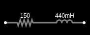
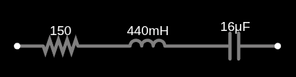
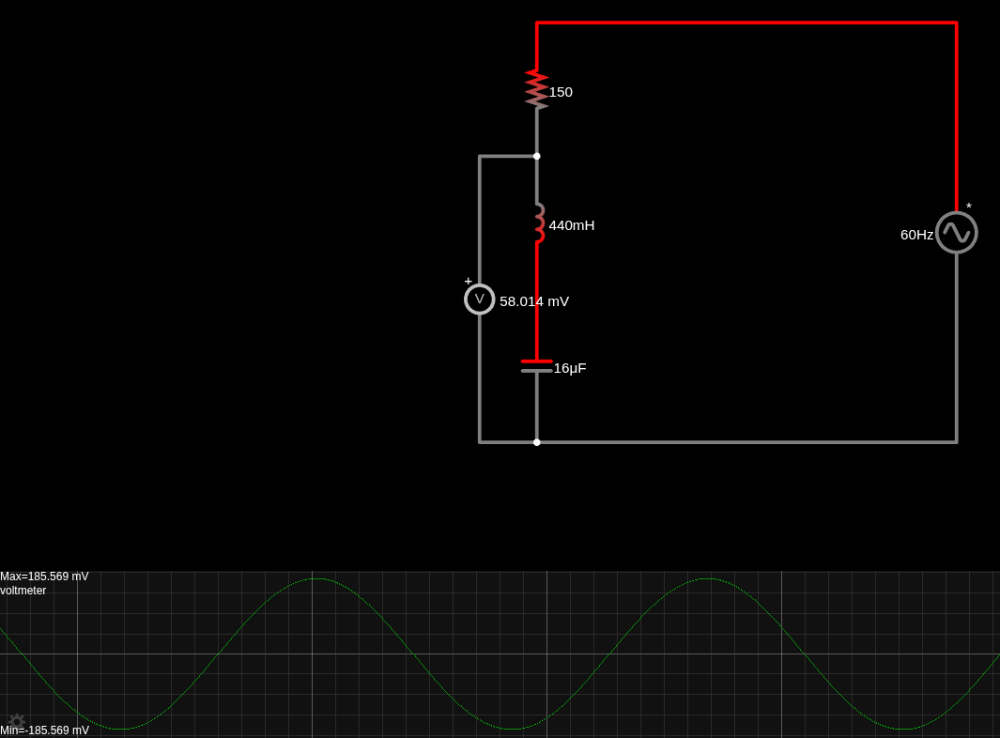
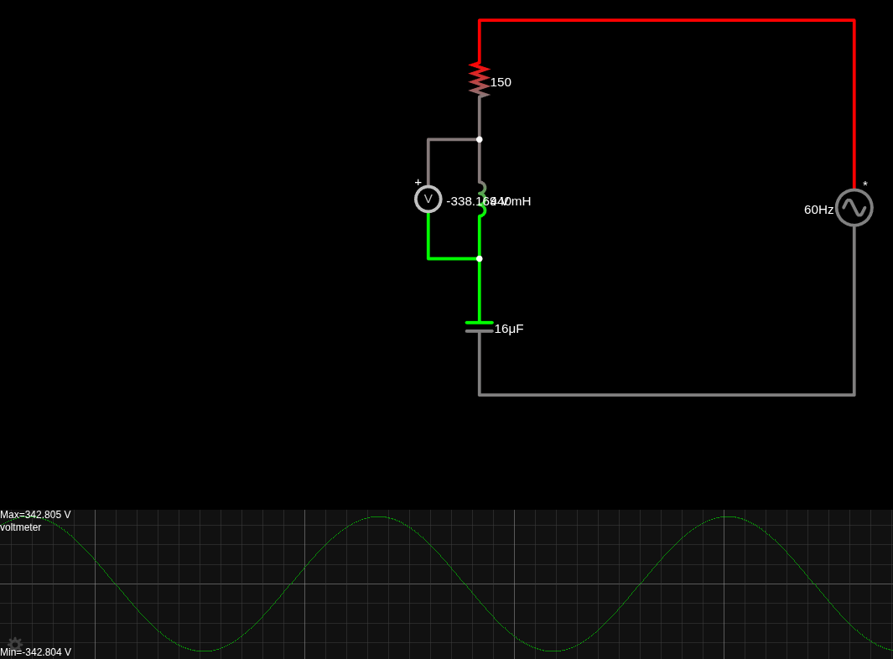
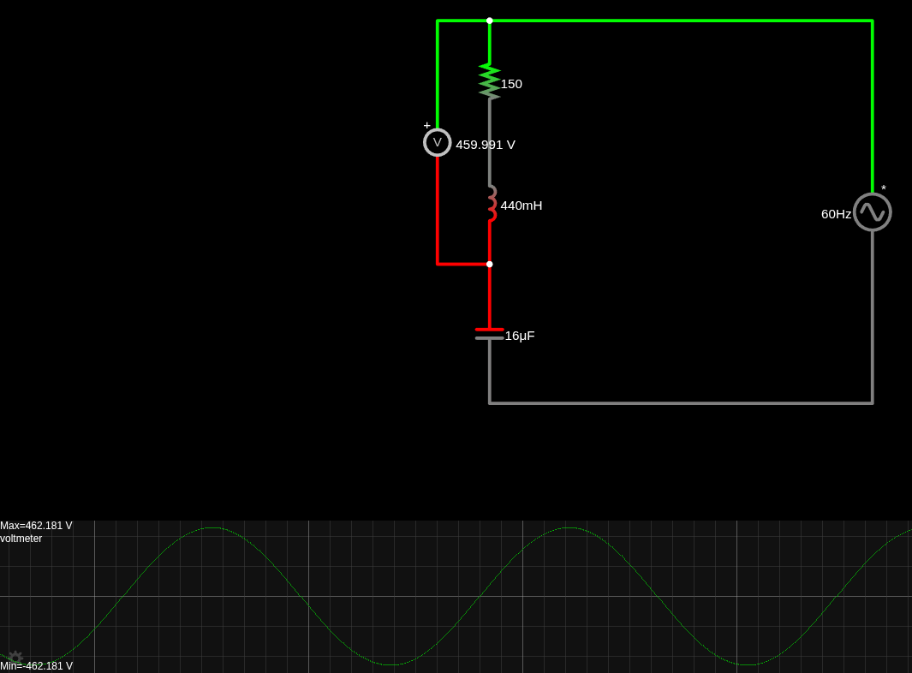

# extensionFixAttempt

This was a theoretical attempt to reduce the motor voltage extension discussed in 0.2.2.

## The Idea

The extension happens because of the motor's inductance. A mathmatical equivalent to the motor could be:

_PS: the 150Ω resistance and the 440mH inductance were measured._

This can be written as their impedances (at 60Hz):

To get rid of the inductance part of the impedance, one could add a series capacitor of the same reactance, which would be:

So the capacitive and inductive reactances would cancel out, remaining just a resistive load.

## The Problem

When wondering what would have to be the maximum voltage of the 16uF capacitor used, something very strange was noticed. As both imaginary impedances cancel out, there would be no voltage between them at all. At first it seemed good, but then we realized there would be also no equivalent voltage between the inductor, which is what creates the movement in the motor.

## The Disillusion

Besides, another phenomenon happens. The voltage between the series of inductor + capacitor is actually zero, but not the voltage between each one individualy.

In fact, it is even greater than the source, 220Vrms.

More than that, the motor voltage goes as high as 326Vrms.

There are no electrolytic capacitor that would be able to handle the required amount of voltage. Also, the motor itself probably isn't prepared to 326Vrms.

Therefore, the series capacitor cannot be used to fix the extension.