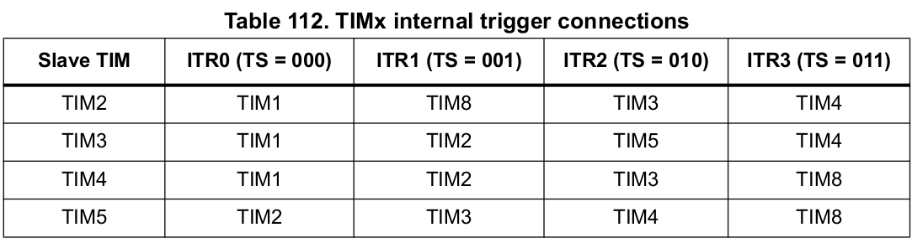

# Timer Link

In "triggerPulse test", a PWM signal was generated to simulate the zeroDetector, and it was connected to the slave timer through an external jumper. Timer Link allows internal connection between master and slave timers.

Reference: "STM32F446RE - Reference Manual"

## TIMx internal trigger connections

This means it is possible to control one timer with another (master - slave) just like was done with external jumpers in "triggerPulse test", but internally.

When a timer's TRGO (Trigger Output) is enabled, it acts as a master in ITRx lines:

In our application we're enabling TIM1's TRGO, so to set TIM2 (also valid for 3 and 4) as TIM1's slave, TIM2's "Trigger Source" is set to ITR0.

As TIM1's "Trigger Event Selection" is set to "Update Event", the overall effect is the same as connecting TIM1's PWM channel to TIM2's Trigger Source channel.