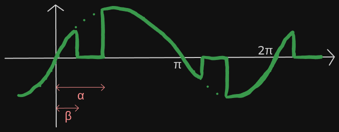

# triggerAngle calculation

In the real application, the power supply is 220V AC, so the cropped wave should look like this:

According to professor João Neves in Liberato Technical School Foundation, the equation of the wave RMS voltage as a function of $\alpha$ (angle elapsed from $0$ to $2\pi$) is:

### $U_{RMS(\alpha)}=\frac{U_{p}}{\sqrt{2}}\cdot \sqrt{1-\frac{\alpha}{\pi}+\frac{\sin{(2\cdot\alpha)}}{2\cdot\pi}}$

$\frac{U_{p}}{\sqrt{2}}$ is the $RMS$ voltage of the AC source. Therefore the $Power Ratio$, defined as the percentage of AC power supply ($220V_{RMS}$) transfered to the load, is:

### $P_r = \sqrt{1-\frac{\alpha}{\pi}+\frac{\sin{(2\cdot\alpha)}}{2\cdot\pi}}$

Now we would just have to rewrite $\alpha$ as a function of $P_r$ in order to calculate what should be the triggering angle according to the desired load $RMS$ voltage. But when doing this, we get to this:

### $2\pi(P_r²-1)=\sin(2\alpha)-2\alpha$

 \
$P_r$ in $x$ axis

This is a transcendental function. Although it has only one $\alpha$ value that satisfies the equation for any $P_r$, you can't rewrite it algebrically in order to obtain it.

In the program, a function is going to be given a $P_r$ and has to output an $\alpha$ according to the equation above. I'm going to use the Newton-Raphson root finding algorithm in order to do that.

## Finding $\alpha$

#### Rewriting

#### $\sin(2\alpha)-2\alpha-2\pi(P_r²-1)=0$

For any given $P_r$ we define the function:

#### $f_{(\alpha)} = \sin(2\alpha)-2\alpha+C$

#### $f'_{(\alpha)}=2\cdot\cos(2\alpha)-2$

So we know that the $\alpha$ value we seek is the root of $f_{(\alpha)}$.

#### Newton-Raphson method

It is a root approximation algorithm.

First you take a guess $x_0$ ($x_1$ in the image above). Note that:

### $\frac{f_{x_0}}{x_0-x_1}=f'_{x_0}$

Where $x_1$ is a step closer to the root (not always the case). Thus, we calculate:

### $x_1=x_0-\frac{f_{x_0}}{f'_{x_0}}$

Then:

### $x_2=x_1-\frac{f_{x_1}}{f'_{x_1}}$

And so on, until $x_n$ is close enough to the root ($f_{x_n}\approx0$).

This algorithm is not perfect and its efficiency highly depends on the function and the first guess. For example, using $\frac{\pi}{100}$ ($\approx0.0314$) as $x_0$ at our $f_\alpha$ with $P_r=0.99$ results in $x_1\approx31.7$, way further from the root $\approx0.46$. Then, $x_2$ and $x_3$ are further and further, with the pattern not stopping before a lot of iterations.

In our case, a first guess with the highest absolute value of the derivative should converge quicker. The peak in $f'_{(\alpha)}=2\cdot\cos(2\alpha)-2 | \alpha\in[0; \pi]$ is at $\alpha=\frac{\pi}{2}$, so this will always be the first guess.

The next step will be to implement this in the STM32 code.

# Considering $\beta$

As the load is inductive, the voltage across it doesn't actually stop at zero as shown in the first image, but extends a bit to the other side of the x-axis for a while. We called this "extension" and measure it as an angle $\beta$.

This results in a real Power Ratio ($P_r$) of more than the one that was just calculated considering a resistive load. To calculate $\alpha$ so that the real $P_r$ is transferred to the load, we have to start by the $U_{RMS}$ of the voltage wave.

Instead of using the equation discussed in the beginning of this document, we must consider that the wave doesn't start at $0$ and stops at $\pi$. The equation follows:

### $U_{RMS(\alpha)}=\sqrt{\frac{1}{T}\cdot(\int_{\alpha}^{\pi+\beta} U_P^2\cdot\sin^2\theta \,d\theta+\int_{\pi+\alpha}^{2\pi+\beta} U_P^2\cdot\sin^2\theta \,d\theta)}$

Since it is a semicycle $\pi rad$ long, the first integral calculates the area between the x-axis and the square of the function while it is effective, which is between $\alpha$ and $\pi+\beta$. The second integral does the same, but with the other semicycle. The sum of both integrals is the area between the x-axis and the square of the sine function. Dividing this area by the period of time elapsed for both functions (one semicycle each; including the moments the wave is cut), which is $2\pi$, results in the overall average voltage, not of the wave, but of its square value. Then the square root of this area is taken, resulting in the $RMS$ voltage of the cropped wave, taking $\beta$ into consideration, as a function of $\alpha$.

We know that the function between $\pi+\alpha$ and $2\pi+\beta$ is symmetrical to the one between $\alpha$ and $\pi+\beta$. Therefore their squares are equal to each other. The equation simplifies to:

### $U_{RMS(\alpha)}=\sqrt{\frac{1}{2\pi}\cdot(2\cdot\int_{\alpha}^{\pi+\beta} U_P^2\cdot\sin^2\theta \,d\theta)}$

### $U_{RMS(\alpha)}=\sqrt{\frac{1}{\pi}\cdot\int_{\alpha}^{\pi+\beta} U_P^2\cdot\sin^2\theta \,d\theta}$

After calculating the integral:

### $U_{RMS(\alpha)}=\frac{1}{\sqrt\pi}\cdot U_P\cdot\sqrt{\frac{\pi+\beta-\alpha}{2}+\frac{\sin(2\alpha)-\sin(2\pi+2\beta)}{4}}$

Simplifying:

### $U_{RMS(\alpha)}=\frac{U_P}{\sqrt2}\cdot\sqrt{\frac{\pi+\beta-\alpha}{\pi}+\frac{\sin(2\alpha)-\sin(2\beta)}{2\pi}}$

As $\beta$ happens because of the current induced by the motor, this means that the greater the current, the longer the extension must be. This current is a function of $U_{RMS}$, which is a function of $\alpha$. We conclude that $\beta$ is a function of $\alpha$.

After talking to professor João Neves again, we found out that there is an equation $\beta=f_{(\alpha)}$. However, the internal resistance of the motor, its inductance (which varies according to the RPM) and another variable $\phi$ (related to the conduction time, which itself is related to $\beta$) were components of the equation. We decided it would be more viable to just measure multiple $\alpha$ $\beta$ pairs and extract a function from that.

The measurements follow ($x$ is $\alpha$; $y$ is $\beta$)

At $\alpha=138.9°$ the motor was moving in spikes. It was barely spinning. We can consider $140°$ as the maximum $\alpha$ (minimum $P_r$) so that the motor works. Similarly, at $\alpha=46.29°$, the ending of the extension starts to merge with the start of the next cycle's trigger. Therefore, we are also going to consider $45°$ as the minimum $\alpha$ for maximum $P_r$.

Inside this range, $\beta$ doesn't really change much. It is reasonable, according to the data table, to just consider $\beta$ as a constant. $40°$ should be good.

Applying $\beta=40°$ to the $U_{RMS(\alpha)}$ equation:

### $U_{RMS(\alpha)}=\frac{U_P}{\sqrt2}\cdot\sqrt{\frac{\frac{11\pi}{9}-\alpha}{\pi}+\frac{\sin(2\alpha)-\sin(\frac{4\pi}{9})}{2\pi}}$

### $P_r=\frac{U_{RMS(\alpha)}}{220}=\frac{\frac{U_P}{\sqrt2}\cdot\sqrt{\frac{\frac{11\pi}{9}-\alpha}{\pi}+\frac{\sin(2\alpha)-\sin(\frac{4\pi}{9})}{2\pi}}}{220}$

### $\sin(2\alpha)-2\alpha=2\pi P_r^2-\frac{22\pi}{9}+\sin(\frac{4\pi}{9})$

From this point, the solution is exactly the same as previously, in topic [Finding $\alpha$](#finding), with the only difference being the calculation of $C$:

### $C=\frac{22\pi}{9}-2\pi P_r^2-\sin(\frac{4\pi}{9})$

# Code

The file "functions.c" is a working implementation of this. It takes a user input as Power Ratio and calculates an approximate trigger angle ($\alpha$) value according to the equation:

#### $\sin(2\alpha)-2\alpha=2\pi P_r^2-\frac{22\pi}{9}+\sin(\frac{4\pi}{9})$