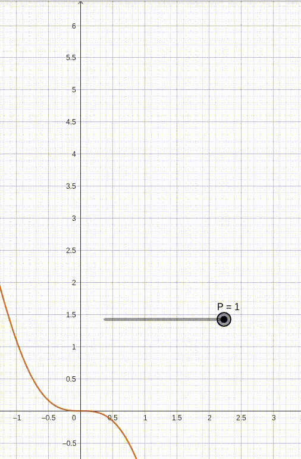

# triggerAngle calculation

In the real application, the power supply is 220V AC, so the cropped wave should look like this:

According to professor João Neves in Liberato Technical School Foundation, the equation of the wave RMS voltage as a function of $\alpha$ (angle elapsed from $0$ to $2\pi$) is:

### $U_{RMS(\alpha)}=\frac{U_{p}}{\sqrt{2}}\cdot \sqrt{1-\frac{\alpha}{\pi}+\frac{\sin{(2\cdot\alpha)}}{2\cdot\pi}}$

$\frac{U_{p}}{\sqrt{2}}$ is the $RMS$ voltage of the AC source. Therefore the $Power Ratio$, defined as the percentage of AC power supply ($220V_{RMS}$) transfered to the load, is:

### $P_r = \sqrt{1-\frac{\alpha}{\pi}+\frac{\sin{(2\cdot\alpha)}}{2\cdot\pi}}$

Now we would just have to rewrite $\alpha$ as a function of $P_r$ in order to calculate what should be the triggering angle according to the desired load $RMS$ voltage. But when doing this, we get to this:

### $2\pi(P_r²-1)=\sin(2\alpha)-2\alpha$

 \
$P_r$ in $x$ axis

This is a transcendental function. Although it has only one $\alpha$ value that satisfies the equation for any $P_r$, you can't rewrite it algebrically in order to obtain it.

In the program, a function is going to be given a $P_r$ and has to output an $\alpha$ according to the equation above. I'm going to use the Newton-Raphson root finding algorithm in order to do that.

## Finding $\alpha$

#### Rewriting

$\sin(2\alpha)-2\alpha-2\pi(P_r²-1)=0$

For any given $P_r$ we define the function:

$f_{(\alpha)} = \sin(2\alpha)-2\alpha+C$

$f'_{(\alpha)}=2\cdot\cos(2\alpha)-2$

So we know that the $\alpha$ value we seek is the root of $f_{(\alpha)}$.

#### Newton-Raphson method

It is a root approximation algorithm.

First you take a guess $x_0$ ($x_1$ in the image above). Note that:

$\frac{f_{x_0}}{x_0-x_1}=f'_{x_0}$

Where $x_1$ is a step closer to the root (not always the case). Thus, we calculate:

$x_1=x_0-\frac{f_{x_0}}{f'_{x_0}}$

Then:

$x_2=x_1-\frac{f_{x_1}}{f'_{x_1}}$

And so on, until $x_n$ is close enough to the root ($f_{x_n}\approx0$).

This algorithm is not perfect and its efficiency highly depends on the function and the first guess. For example, using $\frac{\pi}{100}$ ($\approx0.0314$) as $x_0$ at our $f_\alpha$ with $P_r=0.99$ results in $x_1\approx31.7$, way further from the root $\approx0.46$. Then, $x_2$ and $x_3$ are further and further, with the pattern not stopping before a lot of iterations.

In our case, a first guess with the highest absolute value of the derivative should converge quicker. The peak in $f'_{(\alpha)}=2\cdot\cos(2\alpha)-2 | \alpha\in[0; \pi]$ is at $\alpha=\frac{\pi}{2}$, so this will always be the first guess.

#### Code

The file "functions.c" is a working demonstration of this. It takes an user input as Power Ratio and calculates an approximate trigger angle ($\alpha$) value according to the $2\pi(P_r²-1)=\sin(2\alpha)-2\alpha$ equation.

The next step will be implement this in the STM32 code.