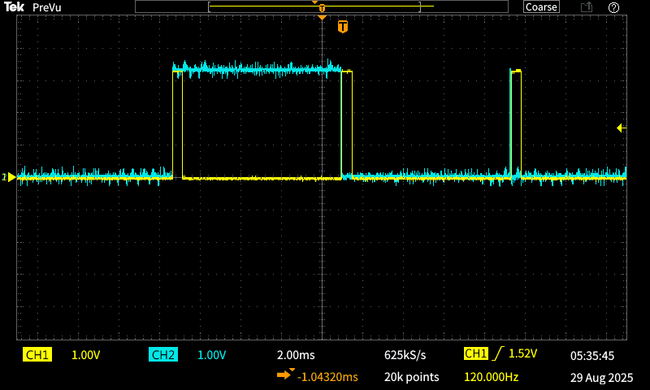

# triggerBridge

At the moment the trigger pulse matches zeroDetector's rising edge, the following happens:

## Hypothesis

After TIM2's OC channel toggles to high, there's no clock tick remaining to toggle it back to low (pulse.rising = pulse.falling). Therefore it stays high until the next cycle.

We thought that this could be fixed by changing line 512 of _main.c_ from `else angle = TIM2->ARR;` to `else angle = TIM2->ARR-1;` or even `else angle = TIM2->ARR-701;`, but the bridge still happened at every cycle reset, regardless of the start and finish angle.