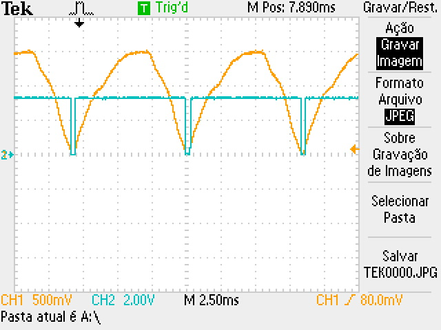
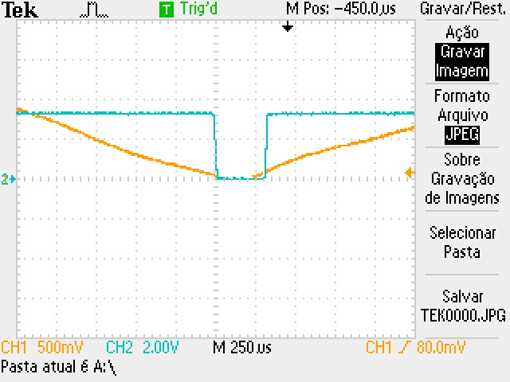

# zeroDetector

## Problem

For some unknown reason, the voltage after rectification isn't behaving as expected. Instead of a completely rectified sine wave from 0V to 310V, the voltage after rectification is:

At one semicycle the voltage drops to 2V and not 0V (expected because of circuit capacitance), but at another it drops to only 108V.

## Solution

This was, as explained by a teaching assistant, due to difference in the internal resistance of each side of the transformer. He told us that a load with less impedance should decrease the dip difference, and he was right.

To enable a load of smaller resistance we transformed the 220Vrms to 12Vrms. After the test, these values of resistance were found reasonable:

This produced:

With a pulse width of ~300us:

